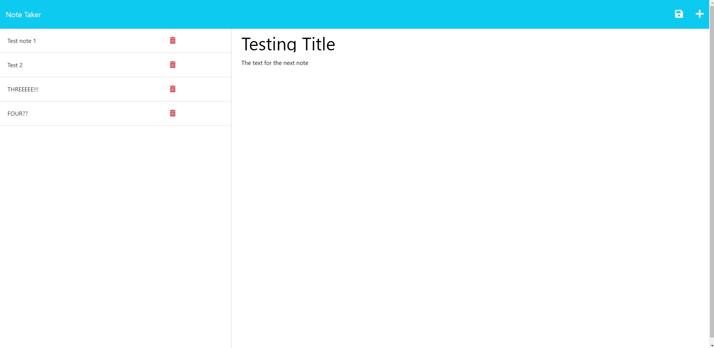

# Week 11 - Express - Final Challenge

  A final project for the 11th week of bootcamp, where we learned EXPRESS.  
  

  ## Description

  This project was built in order to set up the backend of an existing note taking application which was provided as starter code. The application allows a user to use GET, POST, etc., requests in order to take notes and save them. The application stores the existing notes and recalls them for the user upon re-entering the application.

  Screenshot or GIF of final output:  
  

  ## Table of Contents
  * [Dependencies](#dependencies)
  * [Installation](#installation)
  * [Executing Program](#execution)
  * [Authors](#authors)
  * [Questions](#questions)
  * [License](#license)
  * [Acknowledgements](#acknowledgements)
  * [Tests](#tests)

  Link to the repository:  
  https://github.com/dionkb/fuzzy-eureka.git

  ## Getting Started

  ### Dependencies
  Express, UUID, Nodemon (Dev Dependency)

  ### Installation
  N/A

  ## Usage

  ### Executing Program
  Follow link below to the deployed application, and get started using the intuitive layout of the note taking application.
  
  Link to the deployed application:  
  https://gentle-sands-14175.herokuapp.com/

  ## Additional Information

  ### Authors
  Dion Baskara

  ### Questions
  For any questions, please reach out to me at dionkbaskara@gmail.com

  ### Contributing
  To help contribute to the project, reach out to me on Github.  
  There, you can report an issue if you encounter one.  
  GitHub profile: <a href="https://github.com/dionkb">Click Here</a>

  ### License  
  MIT License: For more information,  <a href="https://opensource.org/license/mit/">click here</a>  
  See also: LICENSE.md file located within directory (if applicable) 

  ### Acknowledgements
  N/A

  ### Tests
  N/A
  
